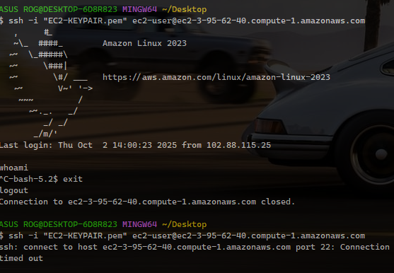

# Security Monitoring and Incident Detection Audit of AWS Environment using Elastic SIEM

## Executive Summary
On October 2, 2025 at approximately 3:00 PM, a successful SSH login was detected from an unauthorized public IP address (102.88.115.25) not associated with our organization's known IP ranges. The incident involved the user account ec2-user (AWS Cloud). The immediate actions were taken to secure the compromised account and investigate the extent of the breach. The investigation suggests a potential credential compromise.


### Incident Timeline

```
Date	        Time	Event Description

October 2, 2025	15:00	Initial Event: SSH login to AWS EC2 instance (172.31.24.129) from public IP (102.88.115.25)
October 2, 2025	15:05	Detection: Alert triggered by the Security Information and Event Management (SIEM) system for login from the untrusted IP
October 2, 2025	15:15	Initial Response: The on-call security analyst began the investigation
October 2, 2025	15:30	Containment: The user account on AWS cloud was disabled, the active SSH session was terminated and instance isolated
October 2, 2025	15:35	Investigation: Log analysis initiated to determine the scope of the attacker's actions
```
## Scope of Impact

## Affected System:
```
- Hostname: ec2-user 
-	EC2 Instance ID: i-0000f7f8cbbc70ee3
-	IP Address: 172.31.24.129
```

## Affected Account:

```
-	Username: victor-ojetokun
```

## Detection

- Detection Method: Custom Elastic SIEM detection rule.
- Rule Name: [HIGH SEVERITY] SSH Access Attempt Detected
- Rule Query: event.category: authentication and event.action:sshd
- Data Source: System logs from the /var/log/secure file, collected by the Elastic Agent.

## Triage & Analysis

- Triggering Event: A successful SSH authentication event was logged by the SSHD service.
- Source: IP Address: 102.88.115.25. This IP was not on an allowed list.
- Target: EC2 Instance: i-0000f7f8cbbc70ee3, Hostname: ec2-user.
- Impact Assessment: As per the environment's security policy, SSH access is strictly prohibited. This activity constituted a direct policy violation and a potential unauthorized access attempt.
- Threat Intelligence: The source IP 102.88.115.25 was checked against AlienVault OTX

## Response & Containment Actions

- Alert Review: The alert was immediately visible in the Elastic SIEM Alerts queue.
- Investigation: "View event details" function to see the full log context, confirming the source and target.
- Containment: Using the integrated response capabilities, I executed the "Isolate host" action directly from the alert, which issued a command through the Elastic Agent to block all network traffic on the host.

##	Verification

The host's status was confirmed as "Isolated" in the Elastic SIEM Hosts overview, confirming the containment was successful.

### Impact Assessment:

- Data Exfiltration: Under investigation, initial analysis of network traffic does not show large data transfers
- System Integrity: Log analysis is ongoing to check for unauthorized commands, file modifications, or malware installation
- Lateral Movement: No evidence of movement to other systems has been found at this time

## Incident Details

- At 15:00 PM on October 2, 2025 an SSH connection was established to a critical EC2 instance running on IP 172.31.24.129. The connection was authenticated using the credentials for the ec2-user (Victor-Ojetokun) and originated from the public IP address 102.88.115.25.
- This activity triggered a high-priority alert because logins from non-VPN or non-office IP addresses are against security policy. The user, ec2-user (Victor-Ojetokun), was contacted and confirmed that he was not working at that time and did not initiate the login, indicating a credential compromise.

## Response and Mitigation Actions

### Immediate Actions:
1.	The active SSH session from the malicious IP was forcibly terminated
2.	The user account was immediately locked to prevent further access
3.	A security group rule was temporarily added to the EC2 instance to block all incoming traffic from the source IP 102.88.115.25

### Ongoing Actions:

1.	A full audit of the commands executed during the session is underway
2.	The affected server is being scanned for malware and rootkits
3.	A password reset has been enforced for the user's account

### OUTCOME





### Root Cause Analysis (Preliminary)

The preliminary root cause appears to be a compromised user credential. The method of compromise is still under investigation but could include phishing, password reuse, or malware on a personal device. The lack of mandatory multi-factor authentication (MFA) for SSH access was a contributing factor that allowed the attacker to gain access with only the password.

## Recommendations and Next Steps

### Immediate:
1.	Complete the forensic analysis of the affected server to determine the full extent of the attacker's actions
2.	Review logs for any similar access patterns across the infrastructure

### Short-Term (1-2 Weeks):

1.	Enforce mandatory MFA for all SSH access to production environments
2.	Implement IP whitelisting for all administrative access to critical servers, restricting it to VPN and office networks

### Long-Term (1-3 Months):

1.	Conduct a company-wide security awareness training session focusing on phishing and password security
2.	Deploy a privileged access management (PAM) solution to better control and monitor administrative access


